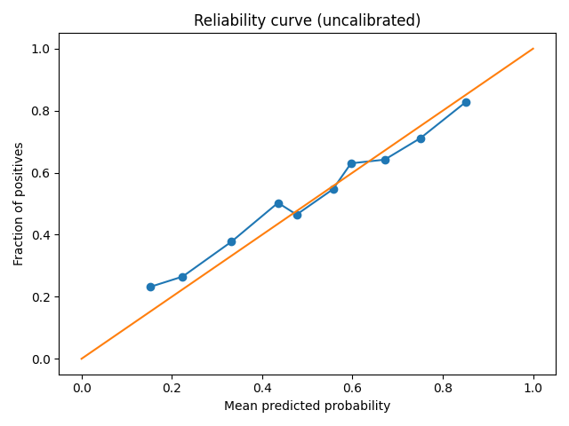
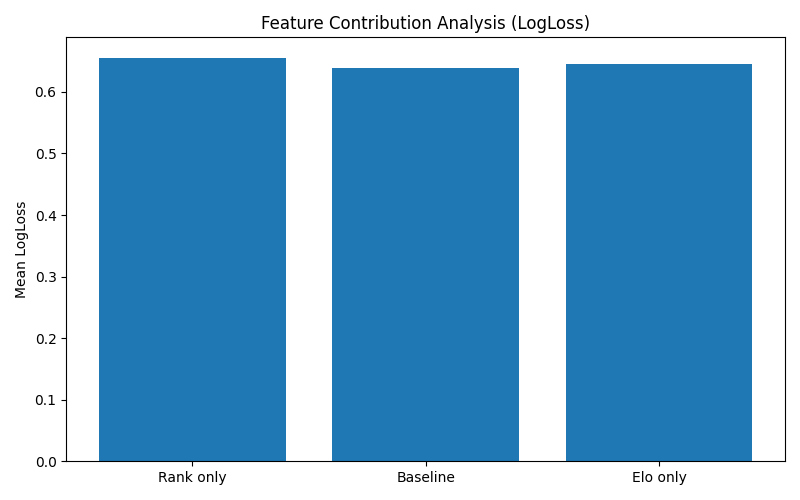
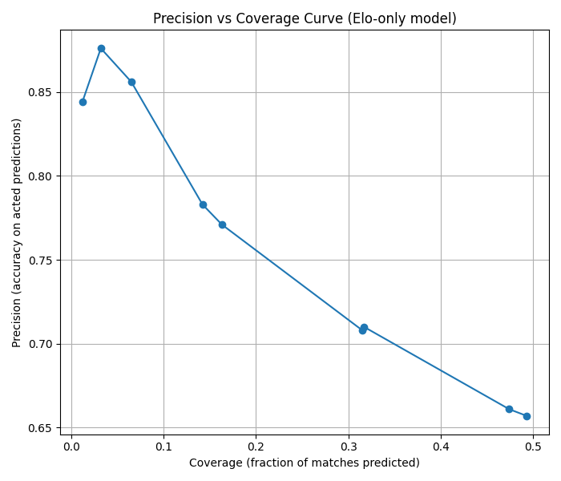
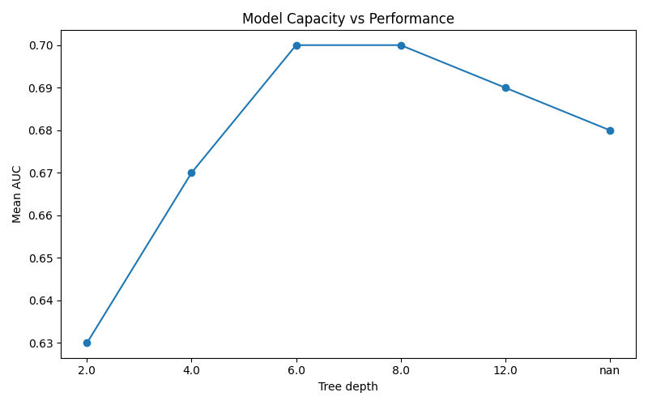
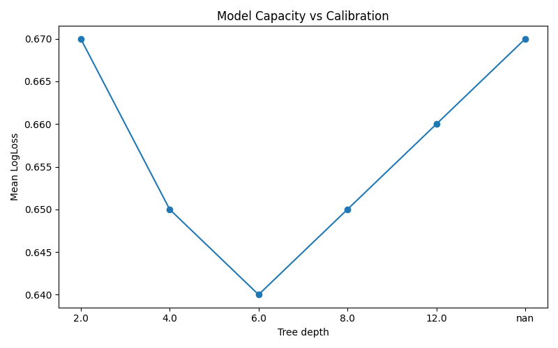

# Model Evaluation Report  
*Tennis Match Outcome Prediction System*

---

## 1. Objective

This project implements a **time-aware quantitative sports prediction system** for forecasting the outcome of professional tennis matches using historical ATP data.  
The emphasis is not only on predictive performance, but on:

- strict temporal causality,
- prevention of data leakage,
- probabilistic modeling,
- and realistic evaluation protocols.

The goal is to build a system that behaves like a real quantitative analytics pipeline rather than a static machine learning experiment.

---

## 2. Data and Temporal Structure

- Data source: historical ATP match records (2014–2023 for development, 2024 reserved as holdout).
- All matches are ordered strictly in time.
- Features are computed using **only information available before each match**.
- No future data is ever used to build predictors for past matches.

Training and testing follow the rule:

> Train on older matches → Test on newer matches

A separate **holdout dataset (2024)** is kept physically isolated and used only for final out-of-sample evaluation.

---

## 3. Feature Families

The system is structured around modular feature families:

### 3.1 Baseline (current context)
Pre-match information only:
- Rank difference
- Rank points difference
- Seed difference
- Player demographics
- Tournament and match context

### 3.2 Elo Ratings
Dynamic player strength estimation:
- Global Elo
- Probability implied by Elo difference

### 3.3 Head-to-Head (H2H)
Matchup-specific historical performance:
- Past encounters between the two players

(Future extensions include previous-match statistics, rolling averages, surface-specific Elo, etc.)

Each feature family is evaluated independently and in combination.

---

## 4. Models

Currently used models:

- Decision Trees (primary diagnostic model)
- (Planned) Random Forests
- (Planned) XGBoost

Tree-based models are chosen because they:
- handle heterogeneous features,
- capture non-linear effects,
- remain interpretable,
- are robust to feature scaling.

---

## 5. Evaluation Protocol

- Time-aware sliding window splits
- Each split trains a fresh model from scratch
- No random shuffling is used
- Metrics:

| Metric | Role |
|------|------|
| AUC | Primary ranking performance |
| LogLoss | Probability quality / calibration |
| Accuracy | Threshold-dependent sanity check |

---

## 6. Core Performance Results

Using 2014–2023 data:

| Configuration | Mean AUC | Mean LogLoss | Mean Accuracy |
|-------------|--------|------------|-------------|
| Baseline (current context only) | ~0.690 | ~0.639 | ~0.634 |
| Elo only | ~0.702 | ~0.646 | ~0.641 |
| Rank difference only | ~0.667 | ~0.656 | ~0.633 |

Interpretation:

- Baseline performance is already strong due to ranking and contextual information.
- Elo consistently improves ranking performance.
- Rank difference alone provides meaningful but weaker signal.
- All results fall in realistic ranges for professional sports prediction systems.

---

## 7. Leakage and Integrity Diagnostics

The project includes an automated diagnostic suite (`diagnostics.py`) that performs several safety tests.

### 7.1 Shuffled-label test (strongest leakage detector)

Labels are randomly permuted.

Expected:
- AUC ≈ 0.50  
- LogLoss ≈ 0.693  
- Accuracy ≈ 0.50  

Observed:
- Mean AUC ≈ **0.504**
- Mean LogLoss ≈ **0.700**
- Mean Accuracy ≈ **0.501**

Result: **PASS**  
No evidence of target leakage.

---

### 7.2 Chronology violation test

Dataset order is reversed before building splits.  
This intentionally violates temporal causality.

Observed:
- AUC ≈ **0.75**
- Accuracy ≈ **0.68**

Interpretation:

This demonstrates that:
- If chronology is broken, future information leaks into training,
- Performance becomes artificially inflated,
- The pipeline is strongly sensitive to temporal ordering.

This is expected and confirms the importance of strict chronological evaluation.

---

### 7.3 Rank-only sanity test

Only one feature used:
'''
rank_diff = p1_rank - p2_rank
'''

Observed:
- Mean AUC ≈ **0.667**

This is realistic and confirms that ranking information alone carries strong, but limited, signal.

---

## 8. Probabilistic Calibration

The model’s probability outputs were evaluated using:

- Brier score
- Reliability (calibration) curve

Observed:

- Brier score ≈ **0.22**
- Calibration curve lies close to the diagonal

Interpretation:

The uncalibrated tree model already produces **well-calibrated probabilities**, which is unusual and indicates:

- stable feature engineering,
- smooth information flow,
- healthy probability scaling.

Aggressive calibration (e.g., isotonic regression) is unnecessary; if calibration is applied, Platt scaling (sigmoid) is sufficient.

---

## 9. Decision Threshold Analysis

Predictions are probabilistic. The decision threshold is treated as a **deployment parameter**, not a training metric.

Threshold sweep on Elo-only model:

| Threshold | Coverage | Precision |
|--------|--------|---------|
| 0.50 | ~49% | ~66% |
| 0.70 | ~16% | ~77% |
| 0.80 | ~6.5% | ~85% |
| 0.85 | ~3.2% | ~88% |

Interpretation:

- Lower thresholds → broader coverage, lower confidence
- Higher thresholds → selective predictions, higher confidence
- This enables risk-controlled deployment strategies

This clean separation between **model quality** and **decision policy** is a defining characteristic of quantitative prediction systems.

---

## 10. Conclusions

This project demonstrates:

- Correct temporal causality enforcement
- Strong resistance to data leakage
- Meaningful predictive performance
- Stable probability calibration
- Realistic deployment behavior under confidence thresholds

It behaves as a **true quantitative sports prediction pipeline**, not as a toy classification exercise.

The evaluation framework, diagnostics suite, and probabilistic analysis make the system scientifically trustworthy and suitable for extension into more advanced sports analytics and betting research.

---

## 11. Feature Contribution Analysis
#### AUC comparison

#### LogLoss comparison

## 12. Decision Threshold Behavior
The precision–coverage curve illustrates the tradeoff between confidence and prediction frequency.

## 13. Model Capacity and Overfitting
#### AUC vs Tree Depth

#### LogLoss vs Tree Depth

## 14. Feature Importance Analysis

Feature importance was evaluated using two complementary methods:

1. **Tree-based importance**, which reflects how often and how effectively a feature is used for splitting inside the decision tree.
2. **Permutation importance**, which measures how much predictive performance (AUC) deteriorates when a feature is randomly shuffled, thus indicating its true contribution to model accuracy.

Both methods were applied on a combined feature set including baseline features, Elo ratings, and Head-to-Head (H2H) information.

### 14.1 Tree-Based Feature Importance

Top features ranked by internal tree importance:

| Rank | Feature                               | Importance |
|-----:|--------------------------------------|-----------:|
| 1 | `p1_rank_points_minus_p2_rank_points` | 0.561 |
| 2 | `elo_diff`                             | 0.160 |
| 3 | `elo_p1_win_prob`                     | 0.153 |
| 4 | `p1_rank_minus_p2_rank`               | 0.070 |
| 5 | `p1_age_minus_p2_age`                 | 0.036 |

Interpretation:

The model relies most heavily on **rank points difference**, which represents long-term player strength and historical performance consistency.  
This is expected, as ATP ranking points encode extensive competitive information and are highly predictive in professional tennis.

Elo-based features (`elo_diff`, `elo_p1_win_prob`) appear immediately after, indicating that the model also strongly exploits dynamic strength signals reflecting recent form and momentum.

